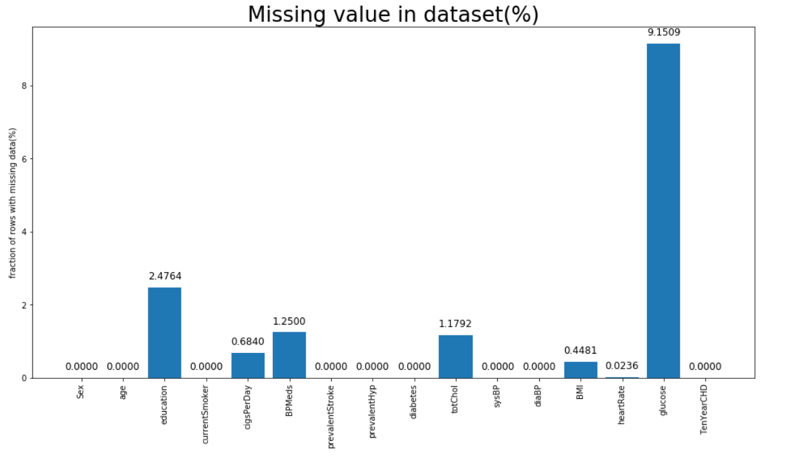
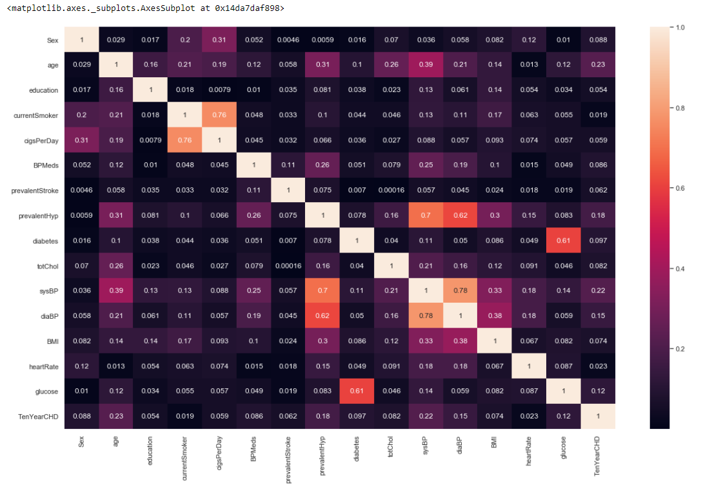
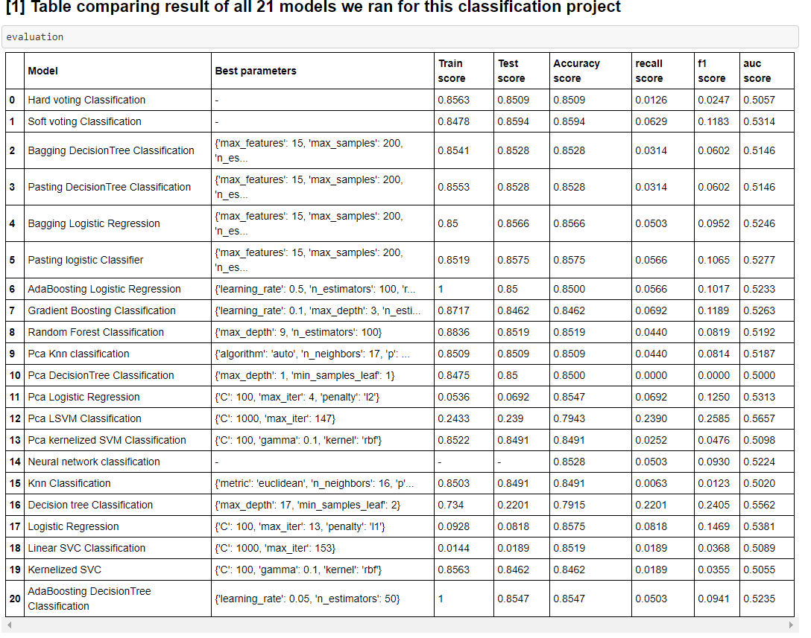
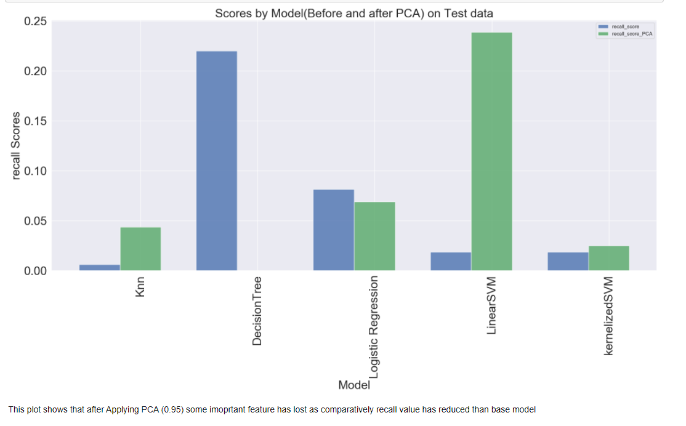
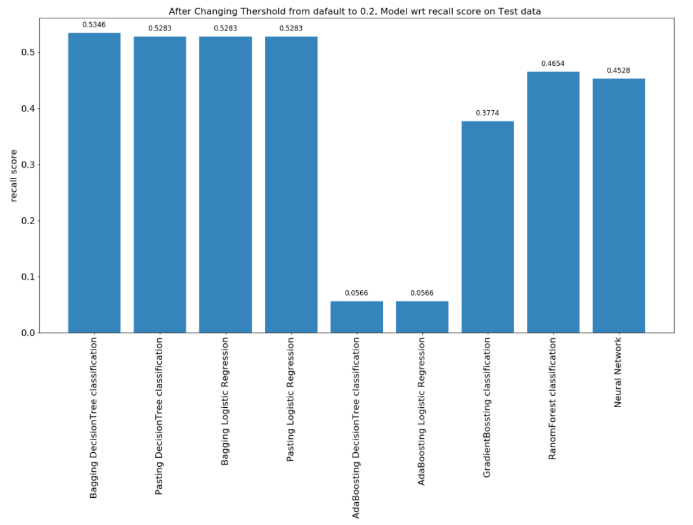
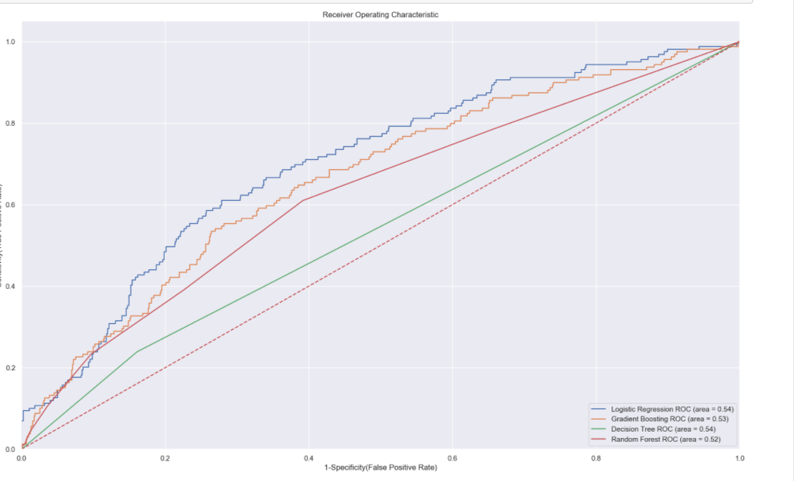

# Framingham-Heart-study--Coronary-Heart-Disease-Prediction

# Primary Objective : 

To  predict the risk of having a heart disease in the next 10 year based on the factors given to us each of which contribute differently towards the lifestyle and pose a higher risk  of heart diseases.

# Data Description: 
- The FHS had over 14,000 people from three generations, including the original participants, their children, and their grandchildren.
- FHS findings have informed the understanding of how cardiovascular health affects the rest of the body.
- In the Framingham heart study we have data for  those  who did or did not develop CHD (Coronary Heart Disease) during the study period.
- Shape of dataset :- (4240,16)

# Data Preprocessing

- Handling Missing value: Replace NaN in each column with the respective column Median

# Data transformation: 
- a) Renaming column  male as Sex.
- b) Mapped categorical variable  Sex and currentSmoker as 0 and 1 .
- c) There are no unique values in the dataset.

# Correlation Matrix to detect outlier

# Evaluation Metrics for Classification
In our dataset we will try to reduce Type II error (false negative), so for Classificaton Tasks our metric of evaluation would be Recall from the Classification Report followed by F1 score and the number of False Positives and False Negatives in the Confusion matrix

# Classification Model
## Built nearly 21 model

'HardVoting Classification','Soft voting classification','Bagging DecisionTree classification','Pasting DecisionTree classification','Bagging Logistic Regression','Pasting Logistic Regression',
           'AdaBossting DecisionTre classification','AdaBossting Logistic Regression','GradientBossting classification','RanomForest classification',
           'Neural network classification',
           'Pca_Knn','Pca_DecisionTree','Pca_LogisticRegression','Pca_LinearSVM','Pca_kernelizedSVM',
           'Knn','DecisionTree','LogisticRegression','LinearSVM','kernelizedSVM'

# Identified Important feature usig Decision Tree

# After applying PCA recall value has reduced which was not expected

# Best Model
## Bagging DecisionTree Classification
## Recall score =0.5346and AUC 0.6369

